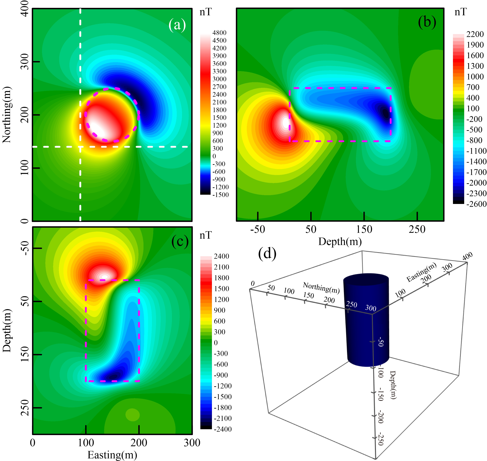
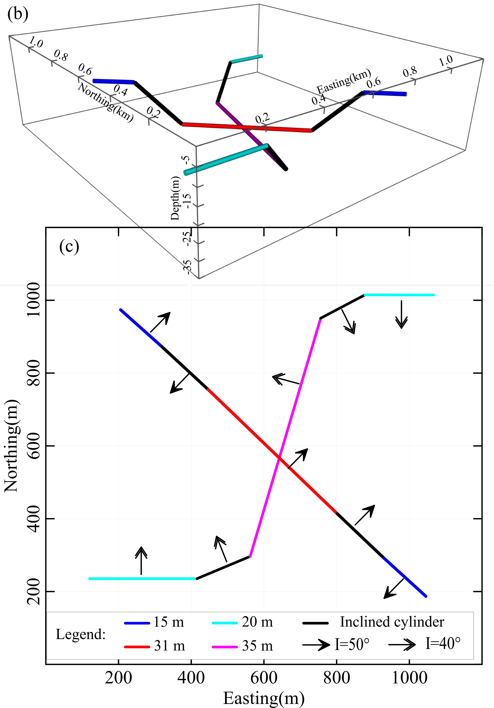
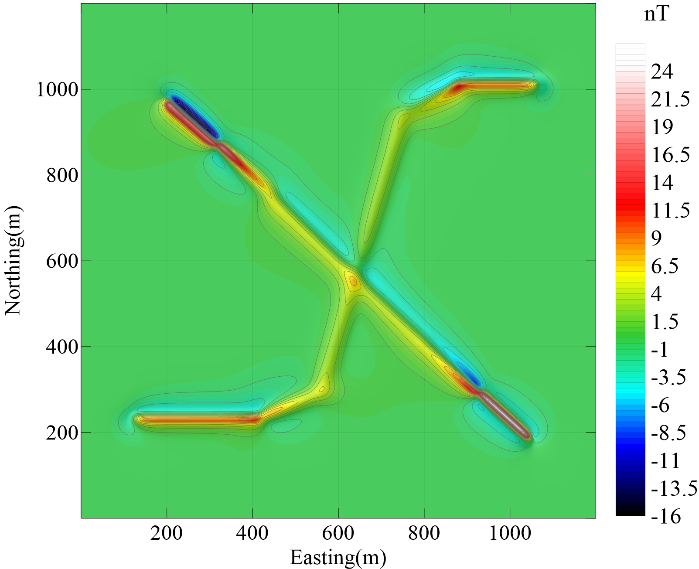

# GMForward_Cylinder

此程序是计算有限长圆柱体的重力异常和磁异常及其导数的程序，有Matlab和C++（稍后会补充）两个版本。正演计算方法是基于共轭复数变量替换的方法，方法细节请参考:

([彩色版](paper/有限长圆柱体磁异常场全空间正演方法-彩色版手稿.pdf)) [郭志馗, 陈超, 陶春辉, & 胡正旺. (2017). 有限长圆柱体磁异常场全空间正演方法. 地球物理学报, 60(4), 1557-1570.](paper/有限长圆柱体磁异常场全空间正演方法-地球物理学报.pdf)

